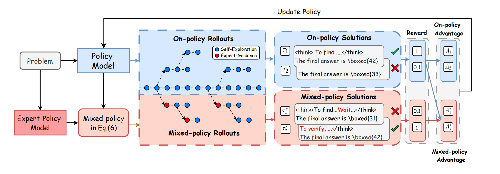
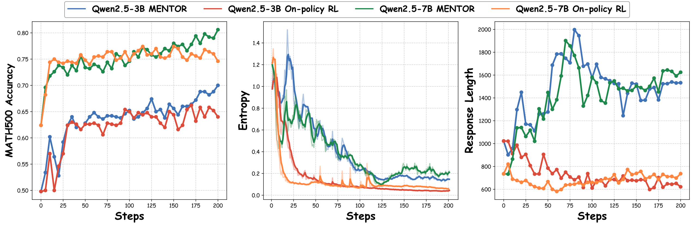
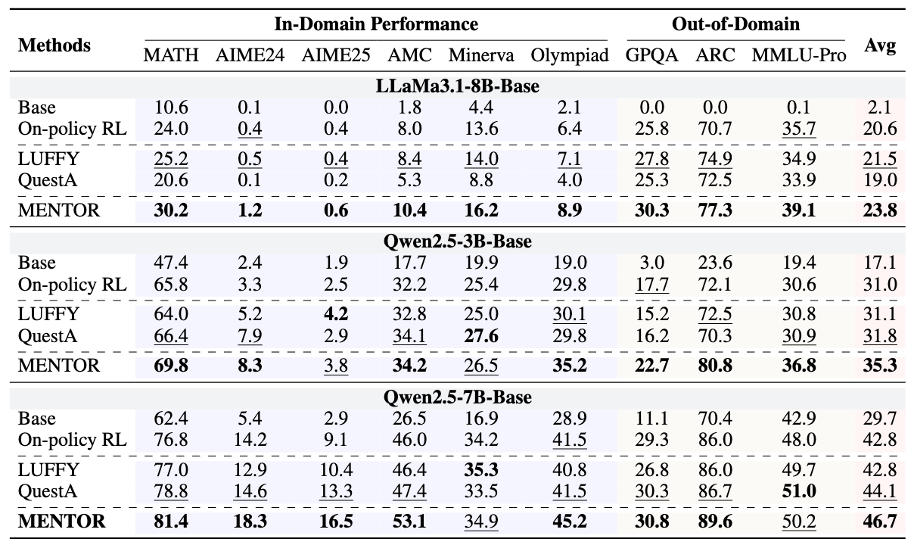

<h1 align="center">Selective Expert Guidance For Effective and Diverse Exploration in Reinforcement Learning of LLMs</h1>

<div align="center"> 

[](https://arxiv.org/abs/2510.04140)
[]() 

</div>


# Introduction
This repository provides the official implementation of *"Selective Expert Guidance for Effective and Diverse Exploration in Reinforcement Learning of LLMs"* 

MENTOR is a framework that enables LLMs to achieve effective and diverse exploration in reinforcement learning by providing expert guidance only at critical decision points, rather than imitating entire expert trajectories.


## Key Highlights
- **Selective Expert Guidance:** Injects expert signals only at critical decision points, avoiding full-trajectory imitation.  
- **Effective & Diverse Exploration:** Balances expert guidance with autonomous exploration, preventing entropy collapse.  
- **Absorb Essence, Remove Redundancy:** Captures essential expert strategies while discarding unnecessary patterns.  


# 🚀 Quick Start
## Installation
You can install MENTOR dependencies by running the following commands:

```bash
conda create -n mentor python=3.11
conda activate mentor
pip install -r requirements.txt
```

## Start Training
Before starting training, we strongly recommend using SwanLab to monitor and manage experiments. You can log in with the following command:
```bash
  swanlab login
```
We provide an example script to train MENTOR on our provided training set. You can run the following command to start training:
```bash
  bash examples/train.sh
```


# 📈 Training Dynamics


MENTOR exhibits clear differences from standard on-policy RL:  
- **Accuracy (acc):** Validation acc steadily improves and surpasses baselines.  
- **Entropy:** Entropy collapses rapidly under vanilla RL, but MENTOR slows this collapse and sustains higher entropy, enabling broader exploration.  
- **Response Length:** Responses first grow longer (absorbing expert-style tokens like *verify*), then shorten as training progresses, reflecting selective retention of useful reasoning patterns.  

Overall, MENTOR achieves better performace, maintains effect and diverse exploration, and converges to more efficient reasoning.

# 📃 Evaluation

MENTOR vs. other baselines. Compared to the On-policy RL, MENTOR achieves an average performance improvement of 3.2%, 4.3% and 3.9% on the three models, respectively. 

# Models
We will release our models soon [🤗HuggingFace](https://huggingface.co/).